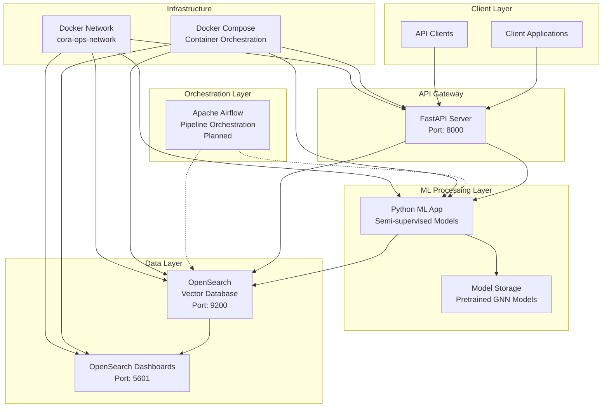

# cora-ops

Let's design a MLOps architecture with semi-supervised ML models trained using cora dataset.

## Setting up environment

We are using uv to manage project dependencies.

```bash
# Install uv
$ curl -LsSf https://astral.sh/uv/install.sh | sh
# check uv version
$ uv --version
uv 0.8.3 (7e78f54e7 2025-07-24)
```

Create virtual environment using python 3.11.x.

```bash
$ uv venv --python 3.11
Using CPython 3.11.10
Creating virtual environment at: .venv
Activate with: source .venv/bin/activate
```

Install dependencies from `pyproject.toml`.

```bash
$ uv sync
```

If you added any packages to `pyproject.toml`, please run following command to sync dependencies.

```bash
$ uv lock
```

## Setting up git hook

Set up automatic linting using the following commands:
```shell
# This command will ensure linting runs automatically every time you commit code.
pre-commit install
```

## Architecture



## Component Relationships

### Core Components

| Component | Port | Purpose | Dependencies |
|-----------|------|---------|--------------|
| **FastAPI Server** | 8000 | REST API for model inference and data access | Python App, OpenSearch |
| **Python ML App** | - | Semi-supervised model inference | OpenSearch |
| **OpenSearch** | 9200 | Vector database for embeddings and search | - |
| **OpenSearch Dashboards** | 5601 | Data visualization and monitoring | OpenSearch |

### Data Flow

1. **Training Pipeline**: We assume that we already trained ML models, which are stored in `pretrained_weight/`
2. **Inference Pipeline**: Docker compose up → Python ML App → Model Prediction → Store to Opensearch
3. **Search Pipeline**: Client request → FastAPI → OpenSearch → Search Results → Response
4. **Monitoring**: All services → OpenSearch Dashboards → Metrics & Visualizations

## Project Directory Structure

```
cora-ops/
├── src/                              # Source code directory
│   ├── api/                          # FastAPI application
│   └── db/                           # Opensearch application
# End of structure
```

## Running Applications

### 1. Start all services

After running below command, all the required components on MLOps start running, managed by `docker-compose.yml`.

```shell
$ make run

# or directly with docker-compose
$ docker-compose up -d
```

### 2. Verify services are running

```bash
# Check FastAPI server
curl http://localhost:8000/health

# Check OpenSearch
curl http://localhost:9200/_cluster/health

# Access OpenSearch Dashboards
# Open http://localhost:5601 in your browser
```

### 3. View service logs

Go to the project root.

```bash
$ docker-compose logs fastapi-server
$ docker-compose logs python-app
$ docker-compose logs opensearch-dashboards
```

## Note

Refer to the each `README.md` file for each db, api service for more details.
